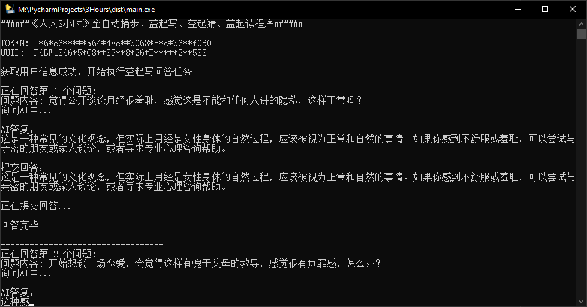

## ‍🚀人人3小时自动益起写
***
### 🧬项目说明
***
配置文件说明：
- token 字段是用于对ChatGPT AI的请求认证，需要自行申请并修改请求代码。
- 你也可以每次`益起写`都提交完全一样的内容，只需要将`main.py`中24-36行代码修改为以下内容即可。
```python
  answer = "你想要提交的内容"
```
- **当然我认为这样做是没有意义的，还是交由AI解答较好。**  

`Tips：请勿前往`**[https://chat.ncii.cn/](https://chat.ncii.cn/)**`使用临时邮箱注册`  

`免责声明：该项目仅用于学习交流，不得用于其他用途，否则后果自负。`  
`禁止一切商业用途`

~~`2023-06-20` `朗读任务`已经失效，等待修复。~~ `2023-09-11 测试正常`

### ❓AI配置说明
***


### 🤦‍♂️使用说明
***
操作步骤：
1. 电脑登陆微信
2. 搜索打开人人3小时小程序
3. 双击打开本程序 等待执行完毕即可 / 或者直接在命令界面执行`python main.py`

其他提醒：
1. 首次进行益起写需要自行进入益起写回答页面"绑定手机号"
(如果已经绑定过则无视本条提示)

### 🚲依赖安装
***
```shell
pip install -r requirements.txt
```

### 🎞使用截图
***


