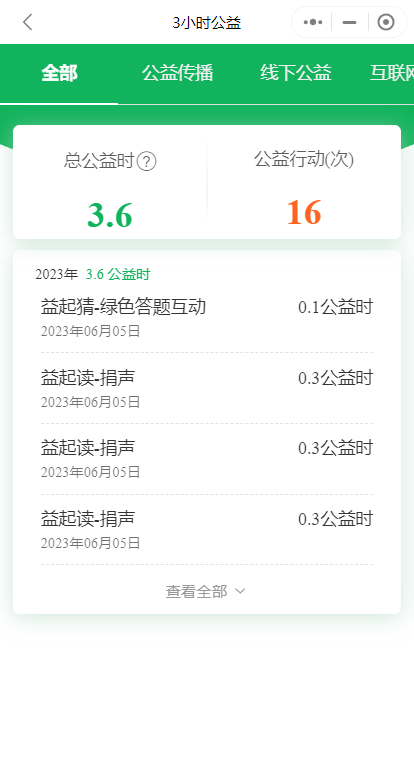

## ‍🚀人人3小时自动益起写
***
### 🧬项目说明
***
配置文件说明：
- `token` 字段是用于对ChatGPT API的请求认证。
- `use_openai` 字段为true则使用OpenAI官方接口，你需要在token字段中填写你在OpenAI官方申请的API Key。
- `proxy` 如果你使用OpenAI官方接口的话，则需要填写为true，若网络环境可以访问OpenAI或使用全局代理请填写为false。
- `http_proxy`和 `https_proxy` 如果你设置`proxy`字段为true，则需要填写http_proxy以及https_proxy字段，以此为访问OpenAI接口设置代理，若你的网络环境或使用全局代理可设置`proxy`字段为false。  
```json
{
  "token": "填写OpenAI官方的API key或使用作者提供的token", // 用于对ChatGPT API的请求认证
  "use_openai": false, // 为true则使用OpenAI官方接口，false则使用仓库作者提供的接口
  "proxy": false, // 为true则需要设置http_proxy以及https_proxy字段
  "http_proxy": "http://127.0.0.1:10801", 
  "https_proxy": "http://127.0.0.1:10801",
  "author": "SwaggyMacro"
}
```
`如果你使用作者提供的token的话请填写use_openai为false，其他字段则不需要填写。`  
你也可以每次`益起写`都提交完全一样的内容，只需要将`main.py`中24-36行代码修改为以下内容即可。
```python
  answer = "你想要提交的内容"
```
**当然我认为这样做是没有意义的，虽然是刷学分，但是万一这东西真有小朋友看呢？那你的良心岂不是要遭受到暴击，所以还是交由AI解答较好。**  

`Tips：请勿前往`**[https://chat.ncii.cn/](https://chat.ncii.cn/)**`使用临时邮箱注册`  

`免责声明：该项目仅用于学习交流，不得用于其他用途，否则后果自负。`  
`禁止一切商业用途`

~~`2023-06-20` `朗读任务`已经失效，等待修复。~~ `2023-09-11 测试正常`


### 🤦‍♂️使用说明
***
操作步骤：
1. 电脑登陆微信
2. 搜索打开人人3小时小程序
3. 双击打开本程序 / 或者直接在命令界面执行`python main.py`
4. 点击小程序中 "下方导航栏→《公益机会》→《益起动》(去捐步)" 微信授权后回到程序按下回车
5. 等待执行完毕即可

其他提醒：
1. 首次进行益起写需要自行进入益起写回答页面"绑定手机号"
(如果已经绑定过则无视本条提示)

### 🚲依赖安装
***
```shell
pip install -r requirements.txt
```
### 🌱常见问题
***


### 🎞使用截图
***



